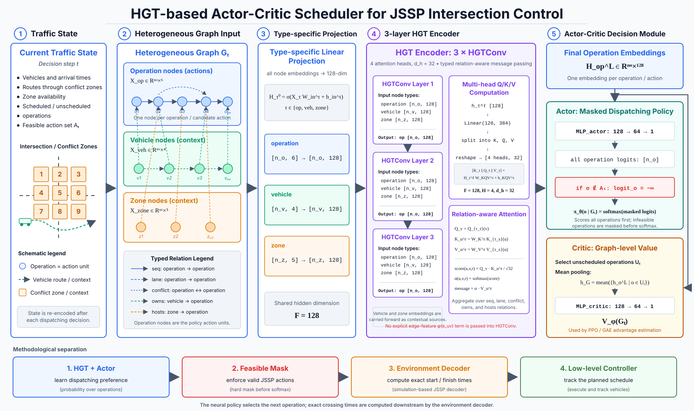

# HGT-JSSP Project Introduction

This document is a beginner-friendly map of the HGT-JSSP repository. It explains
what the project is trying to do, what each folder contains, and the main
technology and methodology behind the code.

## 1. What This Project Does

HGT-JSSP studies how to schedule vehicles through an unsignalized four-way
intersection. Instead of using a traffic light, the system decides exactly when
each vehicle may enter and leave each part of the intersection.

The core idea is:

1. Split the intersection into small conflict zones.
2. Treat each vehicle as a job that must visit zones in a fixed order.
3. Treat each vehicle-zone visit as a scheduling operation.
4. Learn which operation to schedule next using a graph neural network policy.
5. Compare the learned policy against simple baselines and exact optimization.

In scheduling language, this is a Job Shop Scheduling Problem (JSSP). In traffic
language, the system is creating a conflict-free timetable for vehicles.

## 2. Two Main Code Paths

There are two important parts of the repository. They are related, but they serve
different purposes.

### Learned HGT/PPO Scheduler

The learned scheduler lives mainly in `intersection_scheduler/`, with entry
points in `train.py`, `train_4x4.py`, `evaluation/`, and `simulation/`.

This path uses:

- PyTorch and PyTorch Geometric for the neural network.
- A Heterogeneous Graph Transformer (HGT) to read the current scheduling graph.
- Proximal Policy Optimization (PPO) to train the scheduling policy.
- OR-Tools CP-SAT as an exact solver for evaluation.

This is the research-machine-learning part of the project.

### SUMO/TraCI FCFS Live-Control Pipeline

The live traffic simulation pipeline lives mainly in `src/`, `sumo/`, and
`scripts/`.

This path uses:

- SUMO as the traffic simulator.
- TraCI as the Python interface for controlling SUMO vehicles.
- NetworkX graphs to represent live JSSP-style conflict relationships.
- A conflict-zone-aware FCFS scheduler as a clear baseline controller.

This is the traffic-simulation and controller-debugging part of the project.

## 3. Repository Map

### `configs/`

Configuration files for both the learning experiments and the SUMO controller.

- `default.yaml`: hyperparameters for the 3x3 learned scheduler, including PPO
  settings, model size, and training intervals.
- `default_4x4.yaml`: similar to `default.yaml`, but for the larger 4x4
  two-lane intersection.
- `experiment_config.json`: default run settings for the modular SUMO/FCFS
  pipeline, such as mode, scheduler, seed, output directory, and simulation
  horizon.
- `intersection_config.json`: SUMO network paths, lane IDs, control distances,
  scheduling clearance times, and route-to-conflict-zone mappings.
- `vehicle_types.json`: nominal processing times for vehicle classes such as
  passenger cars, delivery vehicles, trucks, and buses.

### `evaluation/`

Scripts for measuring how well the learned scheduler performs.

- `eval.py`: compares a 3x3 HGT checkpoint against the iGreedy baseline.
- `eval_4x4.py`: the same type of comparison for the 4x4 topology.
- `eval_gap.py`: compares 3x3 HGT and iGreedy schedules against an exact
  OR-Tools CP-SAT optimum.
- `eval_gap_4x4.py`: the 4x4 version of optimality-gap evaluation.
- `optimal_solver.py`: builds the CP-SAT model that solves the scheduling
  problem exactly when possible.
- `inspect_scenario.py`: prints one generated scenario, its optimal schedule,
  and constraint checks.
- `verify_solver.py`: brute-force sanity check that the CP-SAT solver matches
  what the environment can actually schedule.

Use this folder when you want to answer: "Is the learned policy better than a
baseline, and how close is it to optimal?"

### `docs/`

Architecture figures and supporting design material.

- `docs/hgt-structure/hgt_actor_critic_scheduler.svg`: the end-to-end learned
  scheduler diagram, from traffic state and heterogeneous graph construction to
  the HGT encoder, masked actor, critic, and downstream schedule execution.
- `docs/hgt-structure/hgt_jssp_flowchart.svg`: a broader JSSP workflow diagram.

Use these figures alongside Section 5 when tracing how an environment state
becomes a dispatching action.

### `intersection_scheduler/`

The main learned scheduling package. This is the best place to start if you want
to understand the HGT/PPO model.

#### `intersection_scheduler/data/`

Scenario generators.

- `scenario_generator.py`: creates 3x3 single-lane intersection scenarios.
- `scenario_generator_4x4.py`: creates 4x4 two-lane intersection scenarios.

Both generators create vehicles with arrival times, routes, processing times,
and velocities. They also define easy, medium, and hard difficulty tiers.

#### `intersection_scheduler/environment/`

The scheduling environment.

- `intersection.py`: defines `Vehicle`, `Operation`, `Zone`, and
  `IntersectionEnv`. The environment schedules one operation at a time.
- `feasibility.py`: computes which operations are legal at the current time and
  prevents deadlock-producing choices.
- `graph_builder.py`: converts the current environment state into a PyTorch
  Geometric heterogeneous graph.

The environment is where the project turns traffic movement into a sequence of
machine-learning decisions.

#### `intersection_scheduler/model/`

The neural network policy.

- `hgt.py`: defines the Heterogeneous Graph Transformer backbone.
- `policy.py`: adds actor and critic heads on top of the HGT embeddings.

The actor chooses the next operation to schedule. The critic estimates how good
the current state is for PPO training.

#### `intersection_scheduler/training/`

Training logic.

- `trainer.py`: 3x3 training loop, rollout collection, curriculum, logging, and
  checkpoint saving.
- `trainer_4x4.py`: 4x4 training loop using the same model and PPO logic with
  the 4x4 scenario generator.
- `ppo.py`: transition records, GAE computation, and PPO minibatch updates.

#### `intersection_scheduler/utils/`

Metrics and baseline helpers.

- `metrics.py`: waiting time, makespan, iGreedy baseline, and HGT-vs-iGreedy
  evaluation helpers.

#### `intersection_scheduler/tests/`

Pytest tests for the learned scheduling code.

The tests cover environment correctness, feasibility masks, model forward
passes, PPO gradient sanity, and equivalence checks for graph-building
optimizations.

### `pyHGT`

This is a tracked placeholder file/path with no implementation content in the
current repository. It may be kept for historical reasons or for a future
external HGT-related integration.

### `results_v2/`

Saved 3x3 training artifacts from an earlier training run.

It contains model checkpoints, TensorBoard event logs, and `eval_results.csv`.
The notes in `NOTES.md` mention that some earlier results were affected by bugs
that were later fixed, so treat this folder as historical experiment evidence.

### `results_v3/`

Saved 3x3 training artifacts from the newer run highlighted in `README.md`.

It contains checkpoint files, `checkpoint_best.pt`, TensorBoard logs, and
`gap_eval.csv`. This is the main 3x3 result folder referenced by the current
README examples.

### `results_4x4/`

Saved 4x4 training artifacts.

It contains later-stage checkpoints, `checkpoint_best.pt`, and TensorBoard logs
for the larger two-lane intersection experiment.

### `scripts/`

Convenience scripts and compatibility wrappers.

- `generate_single_intersection.py`: generates the SUMO single-intersection
  network, route files, demand files, detector file, and SUMO config files.
- `build_intersection_jssp_graph.py`: wrapper around the static JSSP graph
  example in `src.graph.static_jssp_example`.
- `run_traci_fcfs_controller.py`: compatibility wrapper for the modular FCFS
  TraCI controller.
- `run_visual_debug_controller.py`: compatibility wrapper for the live graph
  debugger.

### `simulation/`

Offline visualization for learned schedules.

- `run_simulation.py`: runs a 3x3 HGT or iGreedy schedule and animates it.
- `run_simulation_4x4.py`: same idea for the 4x4 two-lane topology.

These scripts are not SUMO simulations. They replay the schedule produced by
the learned environment and draw the intersection, vehicle movement, and graph
state with Matplotlib.

### `src/`

The modular SUMO/TraCI controller package.

This is a separate, live-simulation-oriented system from the learned
`intersection_scheduler/` package.

Important subfolders:

- `src/common/`: shared dataclasses and type aliases for controller results,
  safety violations, and episode metrics.
- `src/config/`: JSON config loaders and project-path helpers.
- `src/constraints/`: scheduler-independent feasibility checks, reservation
  state, action-mask logic, and deadlock detection.
- `src/evaluation/`: safety validation, episode artifact logging, and metrics
  summaries for SUMO experiments.
- `src/graph/`: conflict-zone definitions, route mappings, graph validation, and
  NetworkX JSSP graph construction helpers.
- `src/schedulers/`: scheduler interface, implemented FCFS scheduler, and a
  placeholder greedy scheduler.
- `src/sumo_interface/`: TraCI observation and vehicle-control helpers,
  including the main live controller loop.
- `src/visualization/`: live Matplotlib debugger for seeing SUMO and the JSSP
  graph side by side.
- `src/main.py`: canonical entry point for the FCFS SUMO experiment pipeline.

### `sumo/`

SUMO traffic-simulation assets.

The main folder is `sumo/single_intersection/`, which contains:

- XML network files for a single unsignalized four-way intersection.
- Route and demand files.
- Detector definitions.
- SUMO config files for baseline and hard demand scenarios.
- A local README explaining the SUMO network structure and how to run it.

Use this folder when you want to run real SUMO traffic simulations rather than
the offline learned-environment animation.

## 4. Important Root Files

### `README.md`

The main project README. It gives the short project description, core command
examples, and headline results.

### `NOTES.md`

Implementation and training notes. It records bugs that were found and fixed,
training observations, and ideas for future improvements.

### `requirements.txt`

The minimal Python dependencies currently listed by the project:

- `torch`
- `torch-geometric`
- `pyyaml`
- `numpy`
- `pytest`
- `tensorboard`

Some scripts also use optional or external dependencies that are not fully
listed there, such as SUMO/TraCI, NetworkX, Matplotlib, and OR-Tools.

### `train.py`

Entry point for training the 3x3 learned HGT scheduler.

Typical command:

```bash
PYTHONPATH=. python train.py --config configs/default.yaml --output results_v3
```

### `train_4x4.py`

Entry point for training the 4x4 two-lane learned HGT scheduler.

Typical command:

```bash
PYTHONPATH=. python train_4x4.py --config configs/default_4x4.yaml --output results_4x4
```

### `plot_training.py`

Utility for plotting TensorBoard scalar logs into a training-curve image. It is
useful when you want a quick visual summary of waiting time, reward, episode
steps, and curriculum phases.

## 5. How the Learned Scheduler Works



The figure separates four responsibilities that are easy to confuse:

1. The graph builder encodes the current scheduling state.
2. HGT and the actor learn a preference over operation-level actions.
3. The feasibility mask enforces the hard JSSP constraints before an action is
   selected.
4. The environment decoder computes exact start and finish times. Any low-level
   vehicle controller acts only downstream to execute that schedule; it is not
   part of the HGT policy.

During training, the critic supplies the graph-level value estimate used by PPO
and GAE. During rollout, each selected operation changes the environment, so the
state is rebuilt and encoded again at the next decision step.

### Step 1: Build a Scenario

The scenario generator creates vehicles. Each vehicle has:

- An ID.
- An arrival time.
- A route, represented as a list of conflict-zone IDs.
- A processing time for each zone.
- A velocity.

For example, a vehicle might need to pass through zones `[2, 5, 8]` in that
order.

### Step 2: Reset the Environment

`IntersectionEnv.reset()` turns vehicles into operations. One operation means:
"vehicle `i` uses zone `z` at route position `j`."

The environment tracks:

- Which operations are already scheduled.
- When each zone becomes free.
- The current scheduling time.
- Remaining zone conflicts.
- Estimated finish times.

### Step 3: Compute the Feasible Set

At each decision step, `compute_feasible_set()` returns a Boolean mask saying
which operations may be scheduled now.

An operation is feasible only if:

- It is not already scheduled.
- Its vehicle has arrived.
- Its previous route operation is done.
- Same-lane leaders have been handled.
- The needed zone is available.
- Scheduling it would not create a deadlock.

### Step 4: Build a Heterogeneous Graph

`build_hetero_graph()` creates a PyTorch Geometric `HeteroData` graph with three
node types:

- `operation`
- `vehicle`
- `zone`

It also creates several edge types:

- `operation -> operation` sequence edges for route order.
- `operation -> operation` lane edges for same-lane ordering.
- `operation -> operation` conflict edges for shared zones.
- `vehicle -> operation` ownership edges.
- `zone -> operation` host edges.

This graph is "heterogeneous" because not all nodes and edges mean the same
thing.

### Step 5: HGT Chooses an Action

The HGT network reads the graph and creates embeddings for operation nodes. The
actor head scores each operation, and infeasible operations are masked out. The
policy then chooses the next operation to schedule.

### Step 6: Environment Schedules the Operation

`env.step(action)` computes the actual start and finish time from:

- Current time.
- Vehicle arrival time.
- Previous operation finish time.
- Zone availability.

The reward is based on how much the total vehicle completion time increased.
Less waiting means a better reward.

### Step 7: PPO Updates the Policy

During training, PPO collects trajectories, computes advantages with GAE, and
updates the actor and critic using minibatches. The curriculum starts with
easier scenarios and gradually moves to harder ones.

## 6. Methodology Summary

This project combines four methods:

1. JSSP formulation: traffic scheduling is represented as jobs, operations, and
   shared resources.
2. Graph representation: the current scheduling state is encoded as a graph of
   vehicles, zones, operations, and constraints.
3. Reinforcement learning: PPO trains a policy to choose good scheduling
   actions through trial and error.
4. Exact optimization evaluation: OR-Tools CP-SAT solves small scenarios exactly
   so the learned policy can be compared against the true optimum.

The simple baselines, especially FCFS and iGreedy, are important because they
answer: "Does the neural policy actually beat a reasonable hand-written rule?"

## 7. Beginner Glossary

### JSSP

Job Shop Scheduling Problem. A classic scheduling problem where jobs contain
ordered tasks, and each task needs a machine/resource. Here, vehicles are jobs,
conflict-zone visits are tasks, and zones are shared resources.

### Conflict Zone

A small area of the intersection that two vehicles cannot safely occupy at the
same time. If two routes use the same zone, the scheduler must order them.

### HGT

Heterogeneous Graph Transformer. A graph neural network designed for graphs
with different node and edge types. This project uses HGT because operations,
vehicles, and zones carry different kinds of information.

### Heterogeneous Graph

A graph with multiple types of nodes or edges. In this project, `operation`,
`vehicle`, and `zone` are different node types.

### PyTorch Geometric `HeteroData`

The PyTorch Geometric data structure used to store heterogeneous graphs. It
keeps separate feature tensors and edge tensors for each node and edge type.

### PPO

Proximal Policy Optimization. A reinforcement-learning algorithm that updates a
policy in controlled steps so training is more stable than directly making very
large policy changes.

### Actor-Critic

A model structure with two outputs. The actor chooses actions. The critic
estimates how good the current state is.

### GAE

Generalized Advantage Estimation. A method for estimating whether actions were
better or worse than expected, used before PPO updates the policy.

### Curriculum Learning

Training that starts with easier examples and gradually increases difficulty.
Here, training starts with fewer/easier vehicles and moves toward harder traffic
scenarios.

### FCFS

First Come, First Served. A baseline rule that prioritizes vehicles by arrival
order.

### iGreedy

An intersection-specific greedy baseline. At each step, it chooses among
currently feasible operations using a simple priority rule based on vehicle
arrival and route position.

### CP-SAT

A constraint-programming solver from Google OR-Tools. It solves integer
constraint problems and can prove that a schedule is optimal.

### SUMO

Simulation of Urban MObility. An open-source traffic simulator used here for
live vehicle simulation.

### TraCI

Traffic Control Interface. A Python-controllable interface for stepping a SUMO
simulation and sending commands such as stopping or releasing vehicles.

### TensorBoard

A logging and visualization tool commonly used during machine-learning
training. This project logs training curves under result folders such as
`results_v3/tb`.

### Checkpoint

A saved model file, usually ending in `.pt`. It stores learned neural-network
weights and sometimes optimizer state so training or evaluation can resume later.

### Optimality Gap

The difference between a scheduler's result and the exact optimal result. If
HGT has a small gap above `W*`, it means the learned policy is close to the best
schedule found by the exact solver.

## 8. Suggested Reading Order

If you are new to this project, a good order is:

1. Read `README.md` for the short overview.
2. Read this file for the full repository map.
3. Open `intersection_scheduler/environment/intersection.py` to understand the
   environment state.
4. Open `intersection_scheduler/environment/feasibility.py` to understand legal
   actions.
5. Open `intersection_scheduler/environment/graph_builder.py` to see the graph
   given to the model.
6. Open `intersection_scheduler/model/policy.py` and
   `intersection_scheduler/model/hgt.py` to see the neural policy.
7. Open `intersection_scheduler/training/trainer.py` to understand training.
8. Open `evaluation/eval_gap.py` and `evaluation/optimal_solver.py` to
   understand exact-solver evaluation.
9. Read `src/main.py` and `src/sumo_interface/traci_runner.py` if you want the
   SUMO live-control path.

## 9. External References

- Heterogeneous Graph Transformer paper:
  https://arxiv.org/abs/2003.01332
- Proximal Policy Optimization paper:
  https://arxiv.org/abs/1707.06347
- PyTorch Geometric `HGTConv` documentation:
  https://pytorch-geometric.readthedocs.io/en/latest/generated/torch_geometric.nn.conv.HGTConv.html
- OR-Tools Job Shop guide:
  https://developers.google.com/optimization/scheduling/job_shop
- OR-Tools CP-SAT documentation:
  https://developers.google.com/optimization/cp/cp_solver
- SUMO documentation:
  https://sumo.dlr.de/docs/index.html
- SUMO TraCI Python documentation:
  https://sumo.dlr.de/docs/TraCI/Interfacing_TraCI_from_Python.html
